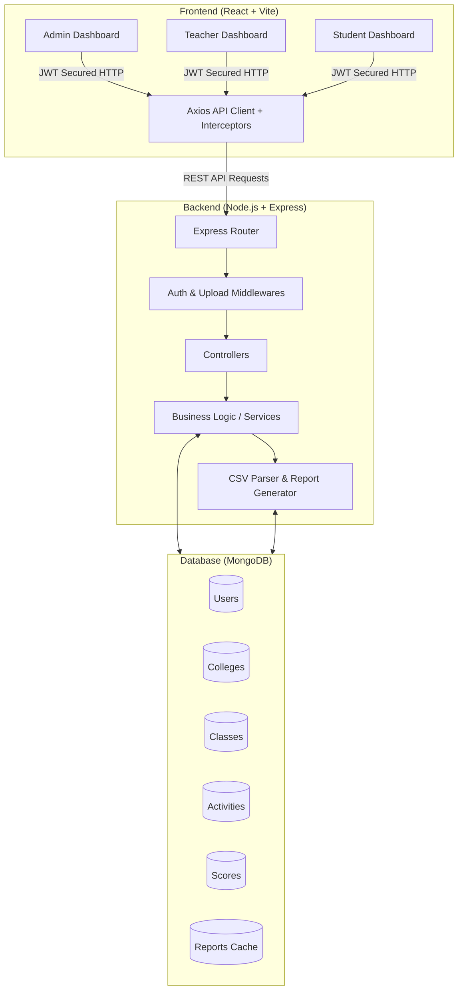
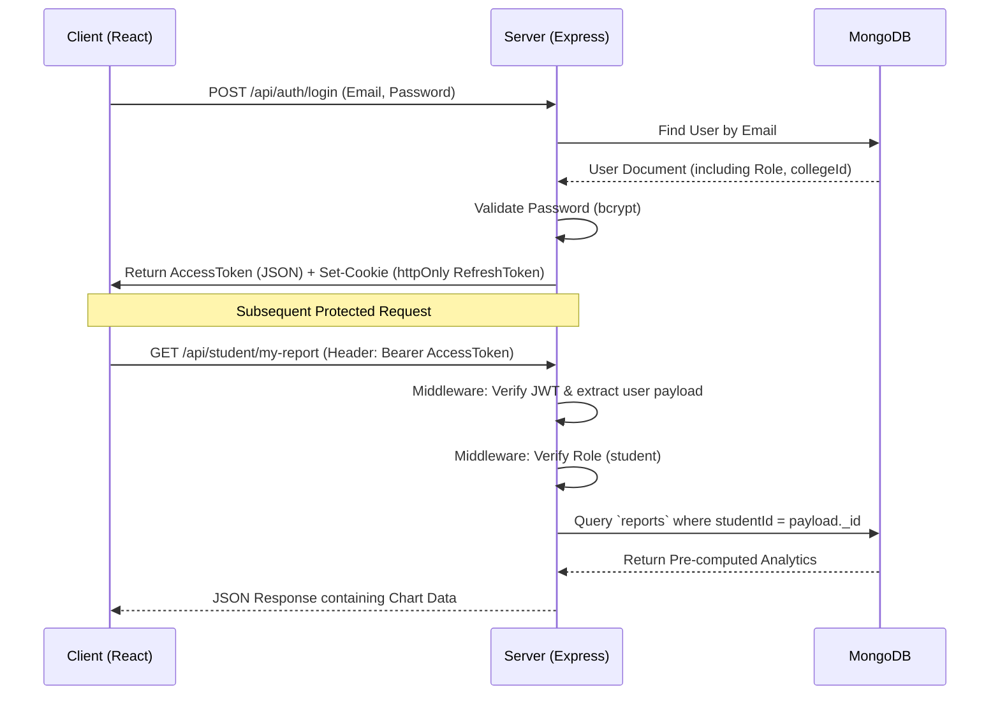
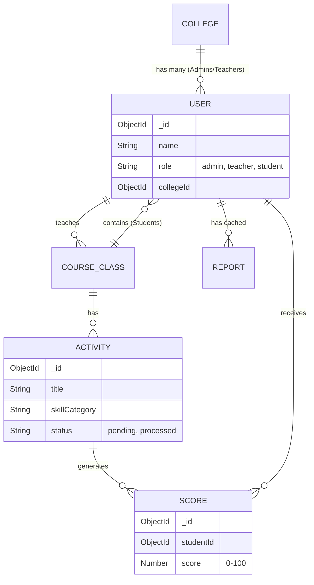

# CRPC Soft Skill Analyser Platform

The **CRPC Soft Skill Analyser Platform** is a full-stack web application designed to track, manage, and visualize the soft-skill development of students across an educational institution. It implements a multi-tenant, role-based architecture allowing Admins, Teachers, and Students to interact with secure and customized dashboards.

## 🚀 Key Features

*   **Role-Based Access Control (RBAC):** Strict security boundaries. Admins manage teachers, Teachers manage students & activities, Students view their reports.
*   **Multi-Tenant Architecture:** Built with `collegeId` scoping to guarantee data isolation across different colleges.
*   **Asynchronous CSV Processing:** Teachers can upload raw CSV datasets for soft skill activities, which are automatically parsed and inserted into the database.
*   **Automated Analytics Generation:** A background report generator pre-computes semantic analytics (averages for Communication, Teamwork, Leadership, etc.) and caches them for fast dashboard rendering.
*   **Dynamic Visual Dashboards:** Rich, interactive charts (Radar Charts, Bar Charts, Line Charts) built with Recharts.
*   **Secure Authentication:** JWT-based system utilizing short-lived access tokens and secure, `httpOnly` refresh tokens.
*   **Cloud Integrations:** File storage ready for Cloudinary/Multer (for CSV processing).

---

## 🏗️ System Architecture

The following diagram illustrates the high-level architecture, showing how different components of the system interact with each other.

---

## 🔐 Role Hierarchy & Authentication Flow

Data isolation is guaranteed at the API level by injecting the validated `collegeId` from the JWT into every database query, ensuring users can never request cross-college data.

---

## 🗄️ Database Schema Relationships

---

## 🛠️ Technology Stack

*   **Frontend:** React.js, React Router, Recharts, Vite, Axios
*   **Backend:** Node.js, Express.js, JWT, Bcrypt, Multer (File Uploads)
*   **Database:** MongoDB, Mongoose ODM
*   **Environment:** Dotenv for variable management

## 📦 Getting Started

1.  **Clone the repository.**
2.  **Install dependencies:**
    *   Navigate to `/Backend` and run `npm install`.
    *   Navigate to `/Frontend` and run `npm install`.
3.  **Environment Setup:** Create a `.env` file in the Backend directory matching the configuration required (Database URI, JWT Secrets, Cloudinary keys).
4.  **Run Locally:**
    *   Backend: `npm run dev` (or node server)
    *   Frontend: `npm run dev`
